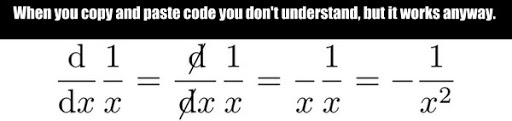

# **HUDM 5026 Fall 2021**
*Rachel Lee*

This site contains my exercise solutions for the book [R for Data Science](https://www.amazon.com/Data-Science-Transform-Visualize-Model/dp/1491910399/ref=sr_1_1?dchild=1&keywords=r+for+data+science&qid=1631763357&sr=8-1) by Hadley Wickham and Garret Grolemund (Wickham and Grolemund 2017) and [Exploring, Visualizing, and Modeling Big Data with R](https://okanbulut.github.io/bigdata/) by Okan Bulut and Christopher Desjardins. Both are great books for R beginners.

